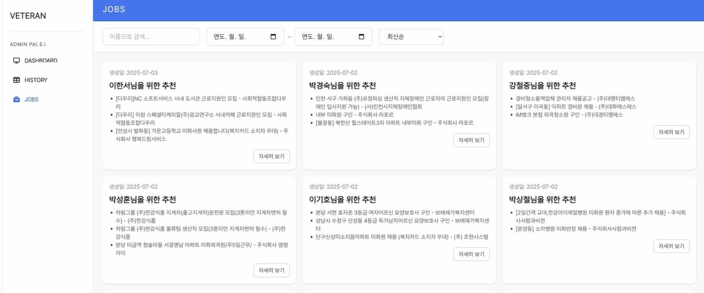

# 📞 Veteran: 어르신을 위한 음성 기반 AI 구직 비서
**🏆 제4회 고용노동 공공데이터 활용 공모전 - 장려상(4위) 수상작**

- [발표 자료](https://github.com/user-attachments/files/22253966/_._Veteran.pdf)
- [시연 영상](https://www.youtube.com/watch?v=q2yR2ewQYic&feature=youtu.be)

<br>

## ✨ 프로젝트 소개

### 고령 일자리 구직 제도의 문제점
현재 많은 고령자들은 일할 의지가 있음에도 정보 접근의 어려움과 디지털 기기의 사용 미숙으로 인해 적절한 일자리를 찾는 데 큰 어려움을 겪고 있습니다. 특히 인터넷 기반의 취업 정보 시스템은 고령자들에게 진입 장벽이 높으며, 이로 인해 고용 기회에서 소외되는 경우가 빈번하게 발생하고 있습니다.

### 개발 목적
`Veteran`은 고령자가 보다 손쉽게 본인에게 적합한 일자리를 찾을 수 있도록 **AI 기반 전화 상담 시스템과 맞춤형 일자리 추천 기능을 통합한 솔루션**을 제공합니다. 고령자에게 가장 익숙한 **전화** 매체를 활용하여 별도의 디지털 기기 사용 없이 구직 희망 의사를 전달하고 맞춤형 일자리를 추천받을 수 있도록 돕습니다.

### 주요 기능
- **📞 음성 기반 자동 상담**: 어르신이 전화를 걸면 AI가 자동으로 상담을 시작하며, 정해진 질문을 통해 구직 정보를 수집합니다.
- **🧠 지능형 대화 흐름 관리**: LangGraph를 기반으로 설계된 대화 로봇은 어르신의 답변을 실시간으로 분석하고, 정보가 부족할 경우 추가 질문을 통해 필요한 데이터를 확보합니다.
- **🎯 개인 맞춤형 일자리 추천**: 수집된 어르신의 정보(희망 직종, 경력, 거주지, 건강 상태 등)를 바탕으로 AI가 가장 적합한 일자리를 선별하고 추천 이유까지 함께 제공합니다.
- **📊 관리자 대시보드**: Streamlit으로 구현된 웹 대시보드를 통해 전체 상담 현황, 통계 등 운영 지표를 실시간으로 모니터링할 수 있습니다.

<br>

## 서비스 구성
### 1. 음성 상담 흐름
> 정해진 필수 질문들을 듣고, LLM이 판단해 정보가 전부 기재돼 있다면 다음 질문으로, 정보가 부족하다면 다시 같은 질문을 합니다. 
해당 로직은 Langraph를 통해 workflow의 형태로 구현되었습니다.

<figure><figcaption></figcaption></figure>

- 서버에 전화가 걸려오면 call_id로 구분하여 conversation flow를 시작합니다.
- 사용자에게 간단한 알림과 함께 정한 필수 질의응답을 시작합니다.
- 사용자의 답변은 녹음되어 STT되어 text로 변환한 뒤, LLM cleansing 작업을 통해 말끔한 답변으로 수정됩니다.
- STT된 사용자의 답변을 LLM이 판단하여 적절하지 않을 경우에는 재시도를, 적절할 경우에는 다음 질문으로 넘어갑니다. (적절하다고 판단된 사용자의 답변만 wav 파일로 녹음됩니다.)
- 대화를 모두 마치면, 여태까지의 대화 History를 저장하고, 해당 History를 바탕으로 어르신의 정보를 구조화된 json으로 저장합니다.

### 2. 일자리 추천 서비스
> 상담을 통해 추출된 데이터를 바탕으로 어르신에게 알맞는 일자리를 추천합니다.

#### 1. 노인 구인구직 정보 수집
- 한국고용정보원 - 워크넷 직업정보
    - 출처 : https://www.data.go.kr/data/3071087/openapi/do
    - 제공 방식 : Open API
    - 주요 내용
        - 국가직무능력표준(NCS) 기반의 직업정보
        - 직무 정의, 필요 역량, 자격 요건, 관련 직업군
        - 산업별 분포, 고용 동향, 평균연령 및 임금정보 등

- 한국노인인력개발원 - 노인 구인정보
    - 출처 : https://www.data.go.kr/data/15015153/openapi.do
    - 제공 방식 : OpenAPI
    - 주요 내용
        - 고령자 대상 단기, 시간제 일자리 채용 공고 정보
        - 지역별 모집 기업, 근무 조건, 임금 수준, 직무 종류 등 포함
#### 2. 어르신에게 알맞는 구인 공고를 추천
- 상담을 통해 저장된 어르신의 정보에서 직업 정보와의 거리로 Score_1 계산 후 가까운 거리 Top 10 추출
- 구인 공고와 어르신 정보를 임베딩 벡터로 변환 후 Cosine 유사도를 계산하여 Score_2 계산
- Score_1과 Score_2를 가중합하여(0.4, 0.6) 최종 추천 공고 5개를 선별

### 3. 관리자 페이지
> 상담을 마친 어르신들의 정보와 추천 일자리 공고를 파악할 수 있는 웹 페이지입니다.

- 상담사는 어르신과 직접 상담할 필요 없이 상담한 내역과 해당하는 어르신의 추천 공고를 확인할 수 있습니다.
- 적절한 구직 정보가 있다면 이를 바탕으로 어르신께 연락하여 일자리를 추천할 수 있습니다.

<figure><figcaption></figcaption></figure>

- History 탭에서 여태까지 상담한 어르신들의 정보 및 대화 로그를 확인할 수 있습니다.

<figure><figcaption></figcaption></figure>


<figure><figcaption></figcaption></figure>


<figure><figcaption></figcaption></figure>

- Jobs 탭에서 상담한 어르신들의 일자리 추천 결과를 확인할 수 있습니다.

<figure><figcaption></figcaption></figure>
<br>

## 🗂️ 프로젝트 구조

```
/Veteran
├── 📄 server.py               # FastAPI 메인 서버 (Twilio Webhook 처리)
├── 📄 conversation_logic.py   # LangGraph 기반 대화 흐름 및 상태 관리
├── 📄 client.py               # Twilio API 및 내부 API 통신 클라이언트
├── 📄 VoiceToText.py          # STT/TTS 변환 처리
├── 📄 requirements.txt        # 프로젝트 의존성 패키지 목록
│
├── 📁 configs/                # LLM 프롬프트(질문, 검증, 출력 형식) YAML 설정 파일
│
├── 📁 dashboard/              # Streamlit 관리자 대시보드
│   ├── 📄 Home.py              # 대시보드 메인 페이지
│   └── 📁 pages/              # 대시보드 하위 페이지
│
├── 📁 recommendation/         # 맞춤형 일자리 추천 모듈
│   ├── 📄 main.py              # 추천 시스템 실행 스크립트
│   ├── 📄 job_crawler.py      # (가정) 채용 공고 데이터 수집
│   ├── 📄 job_filter.py       # 사용자 조건 기반 1차 공고 필터링
│   └── 📄 job_recommender.py  # AI 기반 최종 순위 결정 및 추천 이유 생성
│
├── 📁 recordings/             # 통화 세션별 데이터 저장소 (음성, 로그, 결과)
│
└── 📁 schemas/                # Pydantic 데이터 모델 정의
```

<br>

## 🚀 설치 및 실행 방법

### 사전 준비 사항
- Python 3.9 이상
- Twilio 계정 및 전화번호
- OpenAI API 키
- `ngrok` (로컬 환경에서 외부 Webhook을 받기 위함)

### 설치
1.  **프로젝트 클론**
    ```bash
    git clone https://github.com/Goyong-AI/Veteran.git
    cd Veteran
    ```

2.  **가상 환경 생성 및 활성화**
    ```bash
    python3 -m venv venv_Veteran
    # 가상환경 활성화
    source venv_Veteran/bin/activate
    ```

3.  **의존성 패키지 설치**
    ```bash
    pip install -r requirements.txt
    ```

### 환경 설정
1.  프로젝트 루트 디렉토리(`Veteran/`)에 `.env` 파일을 생성합니다.
2.  아래 내용을 참고하여 `.env` 파일에 환경 변수를 입력합니다.
    ```env
    # OpenAI API 키
    OPENAI_API_KEY="sk-..."

    # Twilio 계정 정보
    TWILIO_ACCOUNT_SID="AC..."
    TWILIO_AUTH_TOKEN="..."

    # ngrok으로 생성된 공개 URL (반드시 /voice 경로 없이 기본 URL만 입력)
    SERVER_URL="https://xxxx-xx-xxx-xxx-xx.ngrok-free.app"
    ```

### 실행
1.  **ngrok 실행**
    로컬 서버(8001번 포트)를 외부에서 접근할 수 있도록 `ngrok`을 실행합니다.
    ```bash
    ngrok http 8001
    ```
    생성된 Forwarding URL을 복사하여 `.env` 파일의 `SERVER_URL`에 붙여넣고, Twilio 콘솔의 전화번호 Webhook 설정에도 동일한 URL(`{SERVER_URL}/voice`)을 입력합니다.

2.  **백엔드 서버 실행**
    ```bash
    uvicorn server:app --host 0.0.0.0 --port 8001
    ```

3.  **대시보드 실행**
    새로운 터미널을 열고 다음 명령어를 실행합니다.
    ```bash
    streamlit run dashboard/Home.py
    ```

4.  **(최초 1회) 채용 공고 데이터 수집**
    추천 시스템을 사용하기 위해 일자리 데이터를 미리 수집해야 합니다.
    ```bash
    python recommendation/job_crawler.py
    ```

이제 설정된 Twilio 번호로 전화를 걸면 AI 상담 시스템이 작동합니다.

<br>

## 👥 팀 및 담당 역할
### [Kimyongari](https://github.com/Kimyongari)
- 아이디어 기획 및 팀원 별 역할 분배
- Twilio 활용 통화서버 구축
- Langraph 기반 대화 플로우 설계 및 개발
- GCP 서버 배포

### [beaver.zip](https://github.com/beaver-zip)
- 추천시스템 개발
- 데이터 수집 및 적용
- 프로토타입 웹페이지 개발

### [dhl0929](https://github.com/dhl0929)
- 아이디어 기획 및 발표자료 제작
- 추천시스템 기획
- FE 개발

### [uzlnee](https://github.com/uzlnee)
- 프로토타입 STT/TTS 개발
- 최종 관리자 웹페이지 개발
- BE 개발
